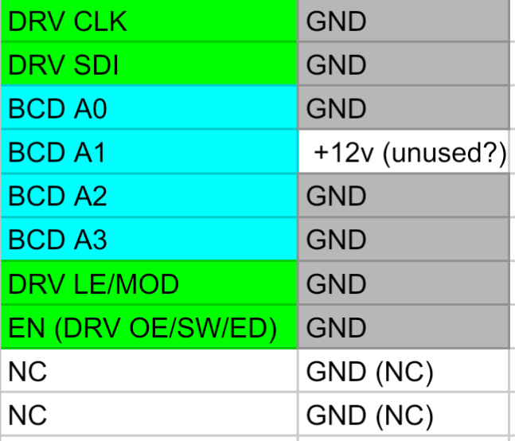

The LED matrix assembly contains two LED matrix panels side-by-side,
a brightness control board, a light-dependent resistor (LDR) board,
and power/data wiring.

# Panels
Each LED matrix panel contains a 16×48 LED matrix PCB, which is composed of two
independent
8×48 matrix quadrants combined on one PCB.

The panel PCBs are connected from bottom to top, right to left (from the front).
In terms of matrix topology and data flow, they function together
as one long 8×192 matrix.

## IC and semiconductor list (per quadrant)
- 3× [74HCT541D](https://assets.nexperia.com/documents/data-sheet/74HC_HCT541.pdf)
octal line driver
- 6× [MB15169GDW](https://www.neumueller.com/datenblatt/macroblock/MBI5169%20Datenblatt%20-%20Datasheet.pdf)
shift register-based LED driver
- 1× [HEF4028BT](https://assets.nexperia.com/documents/data-sheet/HEF4028B.pdf)
4-bit binary to 10-line decimal decoder
- 1× [TD62784AFG](https://docs.rs-online.com/bc35/0900766b80811071.pdf)
high-voltage source driver
- 8× [RD16N05](https://www.mouser.com/datasheet/2/149/RFD16N05SM-98571.pdf)
N-channel power MOSFET

## Row drive arrangement
Each row is switched through a single RD16N05 power MOSFET.
These MOSFETs are driven by the TD62784AFG driver chip.
This chip in turn gets its input from the HEF4028 BCD decoder;
a 0 input to this decoder results in the top row being enabled.

## Column drive arrangement
Each column is driven by one of the output lines of the six MBI5169 chips.
Each chip drives eight columns.
These chips act like shift registers; in this way, data are shifted into each
quadrant, through each column, and then out to the next quadrant.

## Cable pinouts
### Power connector (PL3)
| Pin | Function |
|-----|----------|
| 1   | 3.3 V    |
| 2   | 5 V      |
| 3   | 0 V      |
### Matrix in/out connector (PL1/PL2)

| Pin | Pulldown? | Topo notes                                            |                                       Function |
|-----|-----------|-------------------------------------------------------|------------------------------------------------|
|  1  |       Yes |                                                       | DRV CLK                                        |
|  2  |       N/A |                                                       | Signal ground                                  |
|  3  |       Yes |                                                       | DRV SDI |
|  4  |       N/A |                                                       | Signal ground                                  |
|  5  |       Yes |                                                       | BCD A0 |
|  6  |       N/A |                                                       | Signal ground                                  |
|  7  |       Yes |                                                       |  BCD A1 |
|  8  |           | DNP'd JMP LK1, p 3 of DNP'd PL4, + term of DNP'd C110 | N/C (+12V on control board)  |
|  9  |       Yes |                                                       | BCD A2 |
| 10  |       N/A |                                                       | Signal ground                                  |
| 11  |       Yes |                                                       | BCD A3 |
| 12  |       N/A |                                                       | Signal ground                                  |
| 13  |       Yes |                                                       | DRV LE/MOD |
| 14  |       N/A |                                                       | Signal ground                                  |
| 15  |           | IC1 9/A7 => IC1 11/Y7 → IC6/10/12/14/16 13/!OE/SW/!ED | Output enable inv/Mode switch/Error detect inv |
| 16  |       N/A |                                                       | Signal ground                                  |
| 17  |           |                                                       | ? (N/C on control board)                       |
| 18  |       N/A |                                                       | Signal ground                                  |
| 19  |           |                                                       | ? (N/C on control board)                       |
| 20  |       N/A |                                                       | Signal ground                                  |
